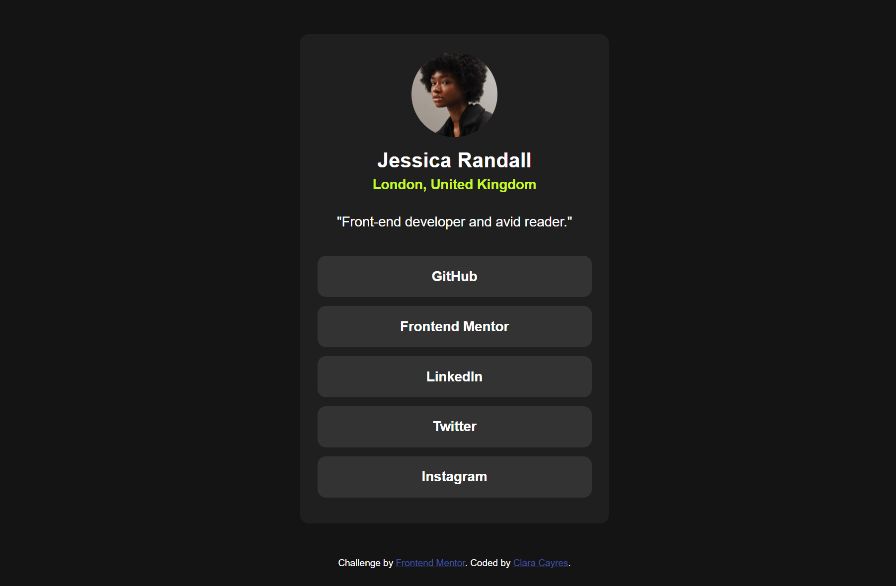
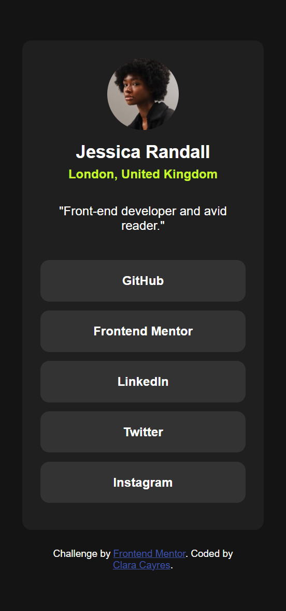

# Frontend Mentor - Social links profile solution

This is my solution to the [Social Links Profile challenge on Frontend Mentor](https://www.frontendmentor.io/challenges/social-links-profile-UG32l9m6dQ). It's a great beginner-friendly project to practice semantic HTML, custom CSS variables, and responsive design.

## 📸 Preview

### Desktop

### Mobile

## 🔗 Links

- Live Site URL: [https://your-live-site-url.com](https://claracayres.github.io/social-links-profile-main)
- Solution URL: [https://github.com/yourusername/social-links-profile](https://github.com/yourusername/social-links-profile-main)

## 🚀 The Challenge

Users should be able to:

- View the optimal layout for the page depending on their device's screen size
- See hover and focus states for all interactive elements

## 🛠️ Built With

- Semantic **HTML5**
- **CSS custom properties**
- **Flexbox**
- Mobile-first workflow
- Local font import via `@font-face`

## 💡 What I Learned

In this project, I practiced:

- Customizing global styles with `:root` variables
- Creating reusable utility classes
- Structuring a clean and minimal HTML layout

Built by Clara Cayres💜